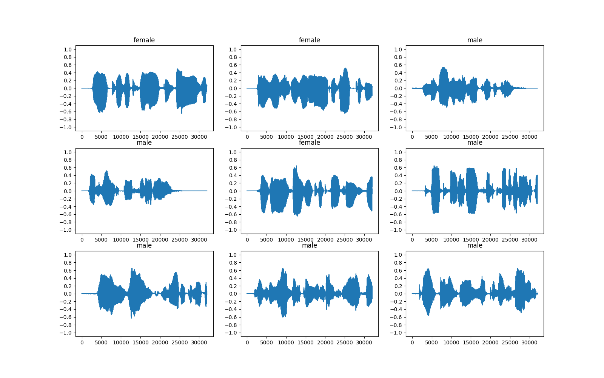
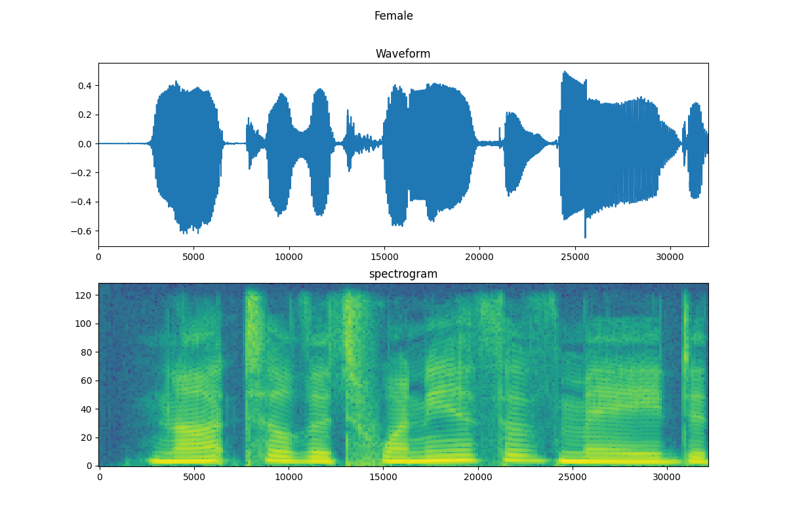
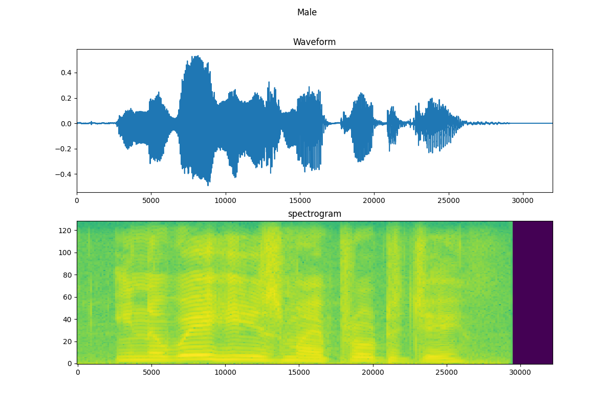
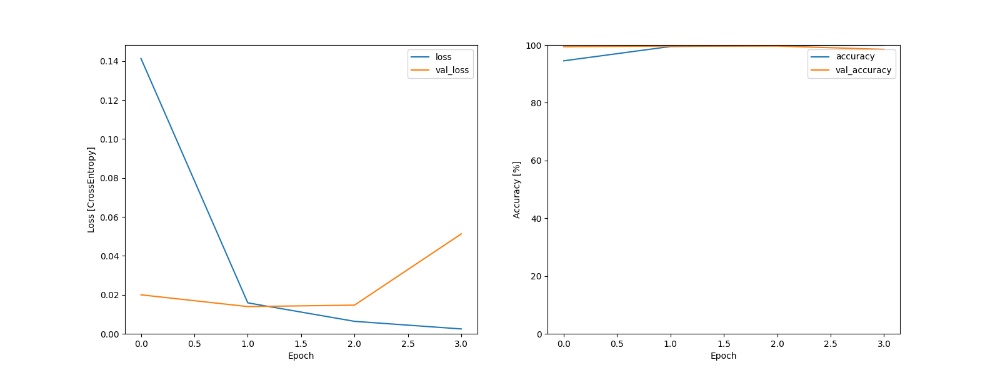
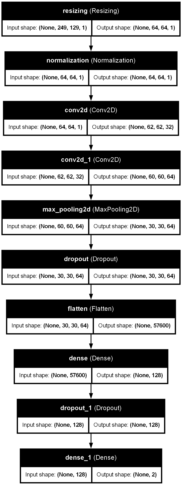

# Audio Spectrogram Classifier

**Dataset used:** https://www.kaggle.com/datasets/murtadhanajim/gender-recognition-by-voiceoriginal (organized in folders per class)

## Setup

- Clone the repository
- Install dependencies:

```bash
pip install tensorflow matplotlib numpy
```

## Images

### Example Waveform Analysis


### Waveform vs Spectrogram Comparison




### Training history


### Model Architecture
